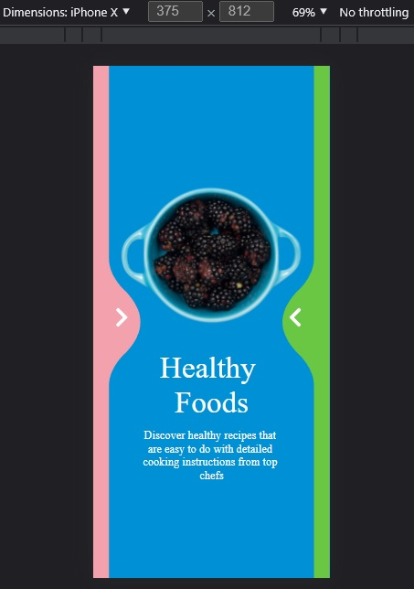

# React Native ClipPath

android: api 21+   
ios : 10.0+   
web: svg    
  
 Example --> [Demo](https://github.com/Only-IceSoul/canal/tree/master/react-native/LiquidSwipe/ClipPath)   


## Getting started

`$ npm install react-native-clippathview --save`  
`$ react-native link react-native-clippathview`  
  
### Yarn

`yarn add react-native-clippathview`

## IOS

**Add Swift**

(If you are using expo sdk >=42 you don't need to do this)

/ios/name_project

add a .swift file

# Usage
ClipPathViewH (Android Layer type Hardware)  
```javascript
import {ClipPathView , ClipPathViewH } from 'react-native-clippathview'

// TODO: What to do with the module?
    <ClipPathView style={{backgroundColor:'green'}} 

       
        d={myPath}
        viewBox={myViewBox}
        
        
    
    >
  
        <View >
            <Text style={{color:'white'}}>hello world</Text>
        </View>
        
    </ClipPathView>

```

## Props   

| Name | description | type | default |
| --- | --- | --- | --- |
| svgKey | Each view must have a different key  | String | "" |
| d | The shape, defined by a series of commands   | String | "" |
| viewBox | defines the position and dimension, in user space    | Array[Number] (4) | undefined |
| align | the aligment     | String | xMidYMid |
| aspect | aspect ratio   | String | meet |
| fillRule | determines what side of a path is inside a shape  | String | nonzero |
| strokeWidth | defines the thickness of a line (mobile) | Number | 1 
| strokeCap | line cap  (mobile) | string | 'butt' |
| strokeJoin | line join  (mobile) | string | 'miter' |
| strokeMiter | control the behavior of miter (mobile) | Number | 4 |
| strokeStart | the start  (mobile) | Number | 0 |
| strokeEnd | the end  (mobile) | Number | 1 |

<br>

### Transform ###  

<br>

The percentageValue property refers to the fact that the Origin will be multiplied by the size of the view.  
  
| Name | type | default |
| --- | --- | --- |
| translateZ | Number (zIndex) | 0 |
| transX | Number | 0 |
| transY | Number | 0 |
| transPercentageValue | Bool | false |
| rot | Number | 0 |
| rotOx | Number | 0 |
| rotOy | Number | 0 |
| rotPercentageValue | Bool | false |
| sc | Number | 1 |
| scX | Number | 1 |
| scY | Number | 1 |
| scO | Number | 0 |
| scOx | Number | 0 |
| scOy | Number | 0 |
| scPercentageValue | Bool | false |


